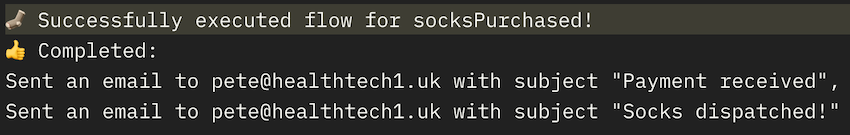

# Stratford Socks API

🧦 An email automation workflow service API for Stratford Socks 🧦

## Get Started

- run `yarn install` at root to install all dependencies
- run `yarn start` to start the server listening on localhost:8000
- send a POST request to `localhost:8000/marketing/flows` with event data in the body, ex:

  ```
  {
    eventName: "websiteSignup"
    userEmail: "pete@healthtech1.uk"
  }
  ```

- run `yarn test` to run tests

## Concepts

- `Flow` - a trigger matching event names associated with a series of steps
- `Step` - a combination of an action, a sequence, and a delay
- `Action` - an action, ex. of type "email", with the data needed to execute it
- `Executor` - a function that executes an action, ex. sending an email

## Solution

The Express application uses a router to handle all requests to `marketing/flows` endpoint.

The flow router finds a `flow` with a `trigger` matching the event name in the request body and executes it.

`flow`s are stored in a JSON file on disk, and can later be moved into an external document database with an API for CRUD operations for easy updates.

Flow execution is done via a recursive function, which will set a timer for the execution of each `step` once the previous one has been resolved.

Each `step` defines the `delay` preceding it (so they can be chained) and a `sequence` to determine it's position in the flow. It also contains the `action` to be executed.

`executor` functions are stored in an object with `type` as their key, so `executor[action.type]` can be called to complete any action.

All `executor`s are asynchronous functions that receive the `event` and `action` as arguments, and either resolve to a success message or reject with an error message.

All information on successful and failed events are sent back with status codes:

- `400`, Bad Request, for incorrect event format
- `500`, Internal Server Error, for incorrect flow formats
- `200`, OK, for successful flow execution

## Example Responses

#### Complete



#### Incomplete


